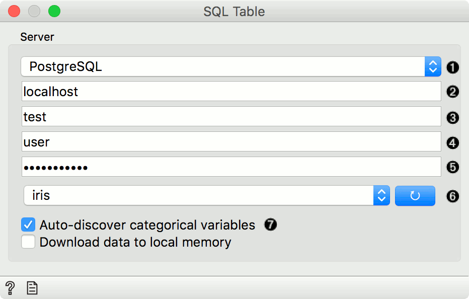
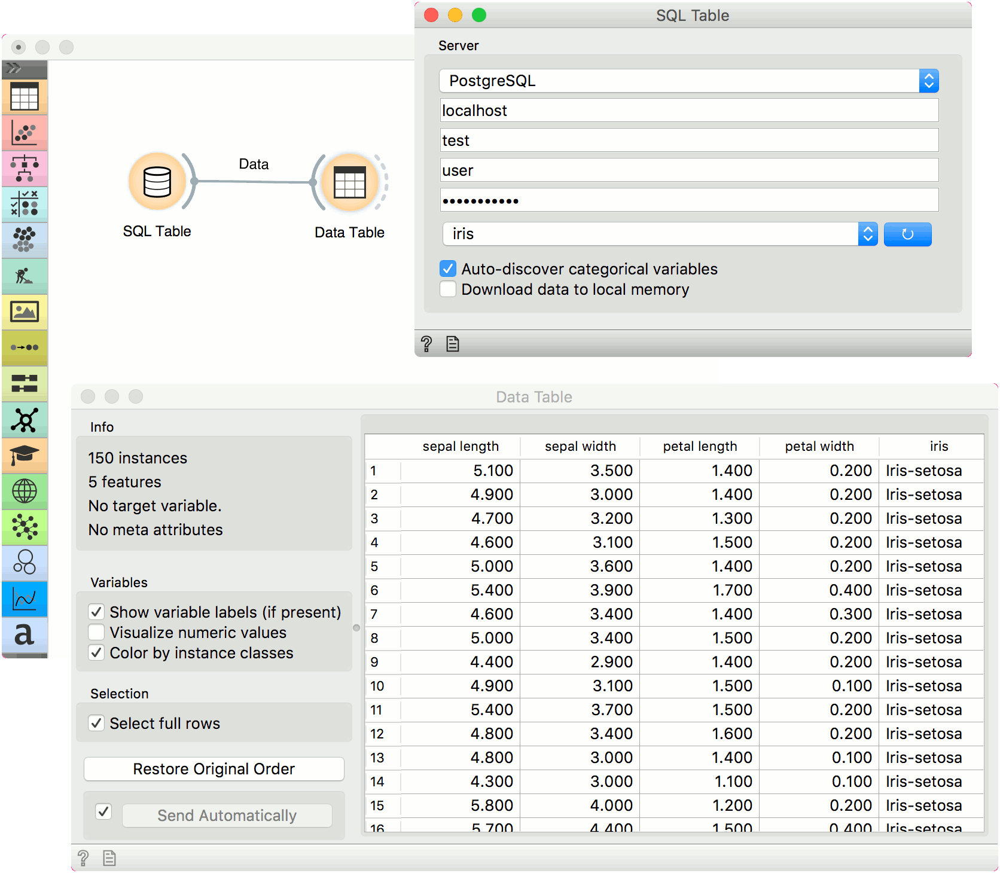

SQL Table
=========

Reads data from an SQL database.

**Outputs**

- Data: dataset from the database

The **SQL** widget accesses data stored in an SQL database. It can connect to PostgreSQL (requires [psycopg2](http://initd.org/psycopg/) module) or [SQL Server](https://www.microsoft.com/en-us/sql-server/) (requires [pymssql](http://pymssql.org/en/stable/) module).

To handle large databases, Orange attempts to execute a part of the computation in the database itself without downloading the data. This only works with PostgreSQL database and requires quantile and tsm_system_time [extensions](https://github.com/biolab/orange3/wiki/Installation-of-SQL-extensions) installed on server. If these extensions are not installed, the data will be downloaded locally.

1. Database type (can be either PostgreSQL or MSSQL).
2. Host name.
3. Database name.
4. Username.
5. Password.
6. Press the blue button to connect to the database. Then select the table in the dropdown.
7. *Auto-discover categorical variables* will cast INT and CHAR columns with less than 20 distinct values as categorical variables (finding all distinct values can be slow on large tables). When not selected, INT will be treated as numeric and CHAR as text. *Download to local memory* downloads the selected table to your local machine.

##Installation Instructions

###PostgreSQL

Install the backend.

    pip install psycopg2

Alternatively, you can follow [these instructions](https://blog.biolab.si/2018/02/16/how-to-enable-sql-widget-in-orange/) for installing the backend.

If the installation of `psycopg2` fails, follow to instructions in the error message you get (it explains how to solve the error) or install an already compiled version of `psycopg2-binary` package:

    pip install psycopg2-binary

Note: `psycopg2-binary` comes with own versions of a few C libraries, among which libpq and libssl, which will be used regardless of other libraries available on the client: upgrading the system libraries will not upgrade the libraries used by psycopg2. Please build psycopg2 from source if you want to maintain binary upgradeability.

[Install the extensions](https://github.com/biolab/orange3/wiki/Installation-of-SQL-extensions). [optional]

###MSSQL

Install the backend.

    pip install pymssql

If you are encountering issues, follow [these instructions](https://github.com/biolab/orange3/wiki/Installation-of-SQL-extensions#mssql).

##Example

Here is a simple example on how to use the **SQL Table** widget. Place the widget on the canvas, enter your database credentials and connect to your database. Then select the table you wish to analyse.

Connect **SQL Table** to [Data Table](../data/datatable.md) widget to inspect the output. If the table is populated, your data has transferred correctly. Now, you can use the **SQL Table** widget in the same way as the [File](../data/file.md) widget.

